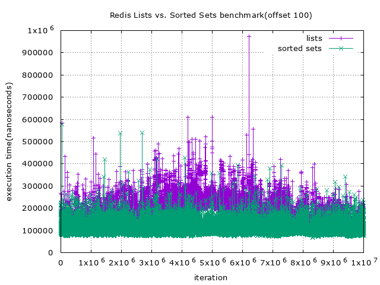
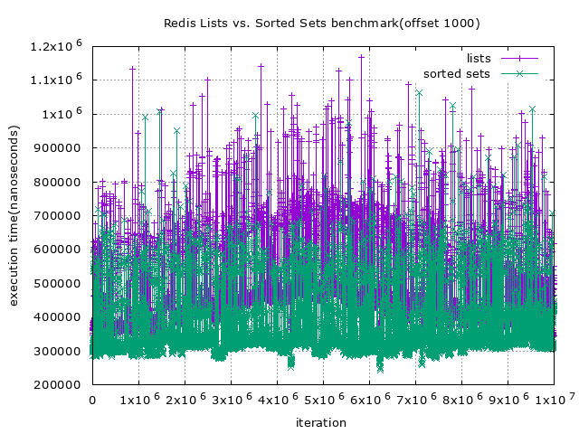
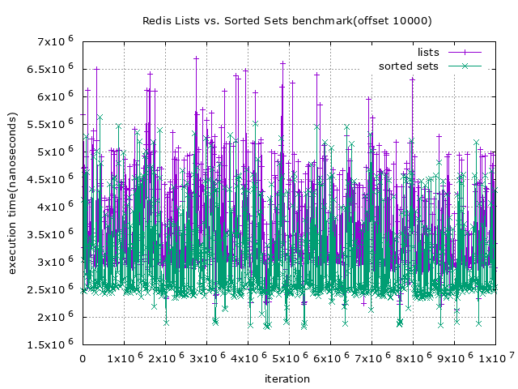

# Redis Benchmark - Lists vs. Sorted Sets
This project shows the benchmark implementation of redis lists and sorted sets

## Benchmark Result




## Environment
```
$ go version
go version go1.19 linux/amd64
$ docker version
Docker version 20.10.18, build b40c2f6
$ redis-cli
> INFO
redis_version: 7.0.0
```

## Plot
```
$ make plot
```

## Run
```
$ docker run --name redis-benchmark -d -p 6379:6379 redis
$ make
$ ./redis-benchmark --init
```
You can also run without `--init` flag, then the benchmark will not try to flush all redis data, it will start doing benchmark immediately

## License
+ This project is licensed under MIT license, see the [LICENSE](./LICENSE) file for more detail